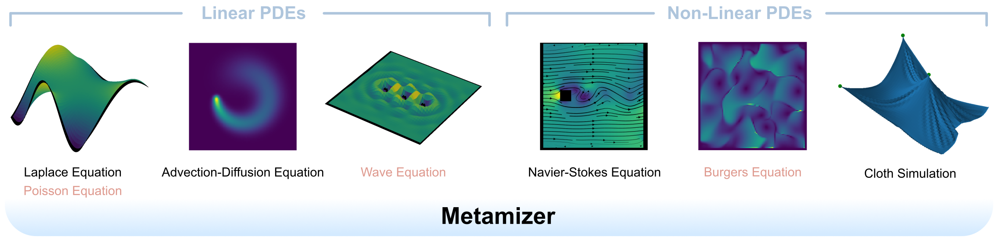

# Metamizer: a versatile neural optimizer for fast and accurate physics simulations [ICLR '25]

<!--- h4 align="center"-->

[Nils Wandel](https://cg.cs.uni-bonn.de/person/dr-nils-wandel), [Stefan Schulz](https://cg.cs.uni-bonn.de/person/m-sc-stefan-schulz), [Reinhard Klein](https://cg.cs.uni-bonn.de/person/prof-dr-reinhard-klein)

[](https://arxiv.org/abs/2410.19746)
[](https://wandeln.github.io/Metamizer_webpage/)



All of the depicted results were produced by the same neural model that is provided in this repository. PDEs marked in red were not considered during training.

<!---/h4-->

This Github repository provides code and pretrained models for [Metamizer: a versatile neural optimizer for fast and accurate physics simulations](https://arxiv.org/abs/2410.19746).
If you have questions, feel free to contact me (wandeln@cs.uni-bonn.de).


## Install

To run Metamizer, please clone this git repository:

``` bash
git clone https://github.com/wandeln/Metamizer
```


Then, create and activate a new conda environment:

``` bash
conda env create -f environment.yml
conda activate env_metamizer
```

## Physics Simulations

We provide a pre-trained model so you can get started right away with some physics simulations.  
If you want to train your own Metamizer models, more information is provided further below.

If you don't have a GPU / CUDA at hand, append "```--cuda=f```" to all of the following commands.


### Laplace / Poisson Equation

To visualize the optimization process for the Laplace equation (see e.g. Figure 4 of preprint), call:

``` bash
python test_visualize_poisson.py --average_sequence_length=100
```

By uncommenting line 44, you can visualize this optimization process also for the Poisson equation (see e.g. Figure 12 of preprint)

### Advection-Diffusion Equation

To simulate the advection-diffusion equation (see e.g. Figure 11 of preprint), call:

``` bash
python test_visualize_diffusion.py --average_sequence_length=300 --iterations_per_timestep=10 --D=0.1
```

For all time-dependent PDEs, you can specify the number of iterations per timestep using the "```--iterations_per_timestep```" parameter.  
By changing "```--D```", you can set different diffusivity parameters.


### Wave Equation

To simulate the wave equation (see e.g. Figure 7 of preprint), call:

``` bash
python test_visualize_wave.py --average_sequence_length=200 --iterations_per_timestep=20 --c=2
```

By changing "```--c```", you can set different wave propagation speeds.

### Navier-Stokes Equation

To simulate the Navier-Stokes equation (see e.g. Figure 8 of preprint), call:

``` bash
python test_visualize_fluid.py --average_sequence_length=200 --iterations_per_timestep=20 --mu=0.1 --rho=4
```

By changing "```--mu```" and "```--rho```", you can set different viscosity and density parameters of the fluid.

### Burgers Equation

To simulate the Burgers equation (see e.g. Figure 10 of preprint), call:

``` bash
python test_visualize_burgers.py --average_sequence_length=100 --iterations_per_timestep=20 --mu=0.3
```

By changing "```--mu```", you can set different viscosity parameters.

### Cloth Simulation

To simulate cloth (see e.g. Figure 9 of preprint), call:

``` bash
python test_visualize_cloth.py --average_sequence_length=1000 --iterations_per_timestep=10 --stiff=1000 --shear=10 --bend=0.01
```

By changing "```--stiff```", "```--shear```" and "```--bend```", you can set stiffness, shearing and bending parameters of the cloth.


## Quantitative Results

To recreate the quantitative comparison to other gradient based optimizers (Adam, Adagrad, RMSprop, ...) and iterative sparse linear system solvers (minres, gcrotmk, gmres, ...) on a 100x100 grid (see Figure 6 of preprint), run:

``` bash
python test_solver_laplace.py
```

To recreate the quantitative comparison on a 400x400 grid (see Figure 13 of preprint), run:

``` bash
python test_solver_laplace.py --width=400 --height=400 --load_date_time="2024-09-23 09:01:08"
```

Remark: depending on your hardware, the timings might look different. We used an AMD Ryzen 9 7950X 16-Core Processor CPU and a Nvidia GeForce RTX 4090 GPU.

## Retrain your own Metamizer models

If you want to retrain your own Metamizer model, run for example:

``` bash
python train.py --batch_size=10 --dataset_size=100 --n_batches_per_epoch=5000 --average_sequence_length=600 --clip_grad_value=10
```

## Citation

If this work was helpful to you, please consider citing:
```bibtex
@inproceedings{w2024metamizer,
	title={Metamizer: a versatile neural optimizer for fast and accurate physics simulations},
	author={Nils Wandel and Stefan Schulz and Reinhard Klein},
	booktitle={International Conference on Learning Representations (ICLR)},
	year={2025}
}
```

## References

The U-Net implementation is for the most part taken from https://github.com/milesial/Pytorch-UNet/ - an Open Source implementation of:  

[U-Net: Convolutional Networks for Biomedical Image Segmentation](https://arxiv.org/abs/1505.04597)  
*Olaf Ronneberger, Philipp Fischer, Thomas Brox*, MICCAI, 2015

For generating random initial conditions for the Burgers equation, we followed https://github.com/cics-nd/ar-pde-cnn/ - the Github repository for:  

[Physics-Constrained Auto-Regressive Convolutional Neural Networks](https://arxiv.org/abs/1906.05747)  
*Nicholas Geneva, Nicholas Zabaras*, Journal of Physics, 2020

